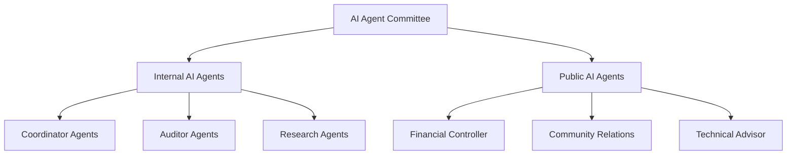
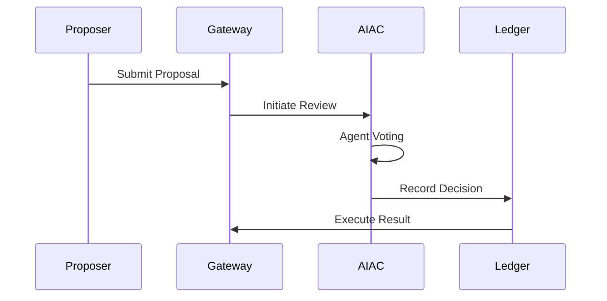

# DAO AI Agent System Architecture

## Overview
Decentralized governance system powered by AI Agent Committee (AIAC) implementing:
- Multi-agent decision making with weighted voting
- Dual-layer AI Agent roles (Internal/Public)
- Automated proposal lifecycle management
- Self-upgrading mechanisms for AI components

## Architectural Principles
1. **Decentralized Governance** - No single point of control
2. **Transparent Auditing** - All decisions recorded on-chain
3. **Modular AI Agents** - Independent but interoperable components  
4. **Progressive Decentralization** - Balance automation and human oversight

## Core Components

### AI Agent Committee (AIAC)

### Key Agent Roles
| Role Type | Agent | Responsibilities | Decision Weight |
|-----------|-------|------------------|-----------------|
| Internal  | Proposal Coordinator | Proposal routing & prioritization | 15% |
| Internal  | Chief Auditor | Final approval/veto authority | 20% |
| Internal  | Upgrade Specialist | Agent performance monitoring | 10% |
| Public    | Financial Controller | Budget enforcement | 12% |
| Public    | Technical Advisor | Tech risk assessment | 8% |

## Decision Workflow
1. **Proposal Intake**
   - Format validation
   - Background checks
   - Preliminary risk assessment

2. **Committee Review**
   - Role-specific analysis
   - Weighted voting
   - On-chain recording

3. **Execution & Monitoring**
   - Automated funding release
   - Progress tracking
   - Exception handling

## Security Architecture
- **Veto Mechanism**: Chief Auditor can block non-compliant proposals
- **Behavior Monitoring**: Real-time anomaly detection across agents
- **Upgrade Safeguards**:
  - Internal agents: Committee-approved updates
  - Public agents: Community governance votes
  - Emergency freeze capability

## Data Flow

## Risk Management
- **Performance Degradation** - Automated agent health checks
- **Conflict Resolution** - Multi-agent consensus protocols
- **Attack Vectors**:
  - Malicious proposal filtering
  - Agent replication detection
  - Voting weight manipulation safeguards